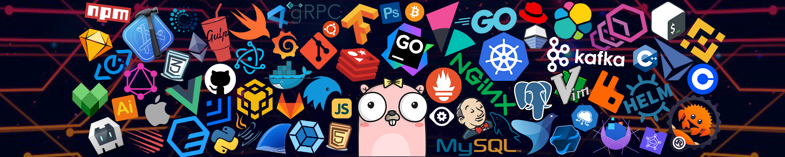
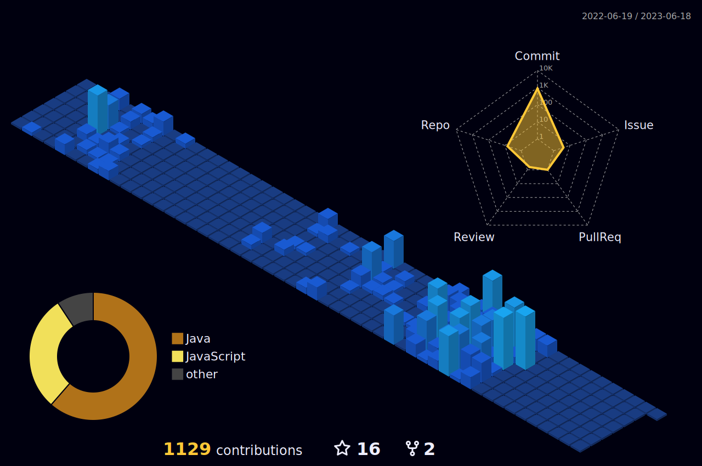

<a href="#!"></img></a>

&nbsp;&nbsp;
&nbsp;&nbsp;
&nbsp;&nbsp;
&nbsp;&nbsp;
&nbsp;&nbsp;
&nbsp;&nbsp;

Software Engineer, experience in developing web applications using React, Node JS, Java (Spring Boot), Go, SQL, PostgreSQL, Mongo DB etc. Also interested in some trending technologies e.g. Microservices, Message Brokers (RabbitMQ, Kafka) and Distributed Systems.

 

### Technologies and Tools

  

 

### GitHub Stats

  

